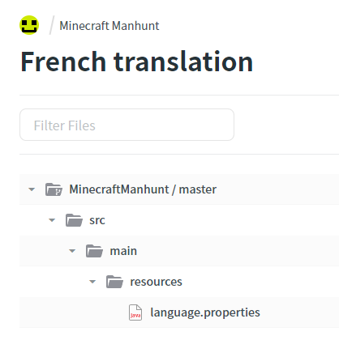

# Translating

This page gives an overview of how to translate Manhunt.

We currently use CrowdIn for translation. Sign up [here](https://accounts.crowdin.com/register) if you don't have a Crowdin account and wish to contribute.

## How to translate

1. Go to the [CrowdIn page](https://crowdin.com/project/minecraft-manhunt).
2. Select the language you wish to contribute to in the list.
3. Select the `language.properties` file.\
   
4. You will now be in the editor. Select phrases to translate on the right, type the translation in the box in the middle, then press submit. Others will be able to vote for your translation and proofreaders will be able to approve your translation as official..png>)

## Proofreaders

Proofreaders can approve translations and lock them if they are known to be correct. In order to become a proofreader, you must be native or fluent in a foreign language we are translating to. If you are, then either send a message on Crowdin, or join the [Discord server](https://rb9.xyz/discord) and create a "General Help" ticket.

## Placeholders

We use placeholders in the text to allow input to be reflected in responses. Here's the rundown:

### Formatting Codes

Formatting codes are in square brackets `[]`. These include colour codes (`[dgrey]`, `[yellow]`, etc), preset colours changed by the user (e.g `[tc]` for text colour and `[ec]` for emphasis colour), and the plugin prefix (`[prefix]`). They should generally be kept the same as in the original.

The prefix should come at the start of the messages which include it.

Colour, formatting, and custom colour attributes change the colour for all text after it, so you don't need to repeat the same colour code if it doesn't need to be changed.

Most of the text should have `[tc]` at the start, with `[ec]` for arguments/other emphasised text, and then changed back with `[tc]`.

`[prefix]` should be at the start of all translations that include a prefix, just like in the source material.

### Arguments

Arguments are sections of text that are inserted into the message before it is sent, used for text such as player names. These are in curly brackets `{}`.

The numerical order of the arguments is not significant in the translated copy, but the numbers are still significant, as each number in the text signifies a different argument.\
For example, if argument `0` was a player name, `{0}` would be replaced with the player name wherever it was in the text, even if `{1}` was before it.
